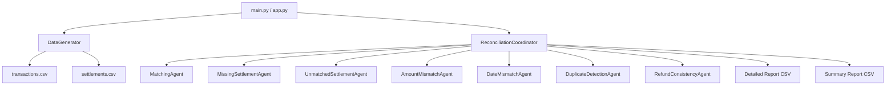

# Payment Reconciliation System

A production-grade, multi-agent reconciliation engine that detects mismatches between internal payment transaction records and bank settlement data.

## Architecture



## Quick Start

```bash
# Install dependencies
pip install -r requirements.txt

# Run the full pipeline via CLI
python main.py

# Run the interactive Streamlit Web App
streamlit run app.py

# Run tests
python -m unittest tests -v
```

## Project Structure

| File | Purpose |
|---|---|
| `app.py` | Interactive Streamlit Web Application interface |
| `data_generation.py` | Synthetic data generation with controlled issue injection |
| `reconciliation_agents.py` | 7 specialized detection agents (OOP, abstract base) |
| `coordinator.py` | Orchestrator: runs agents, deduplicates, builds reports |
| `main.py` | End-to-end CLI entry point with formatted output |
| `tests.py` | Manual + automated test suite (unittest) |
| `requirements.txt` | Python dependencies (pandas, numpy, streamlit) |

## Assumptions

1. Each `transaction_id` maps to at most one settlement in a clean dataset.
2. Refunds reference the same `user_id` and `amount` as the original transaction.
3. Normal settlement delay is 1–5 business days.
4. Rounding tolerance threshold: ≤ $0.05 is "rounding error", > $0.05 is "amount mismatch".
5. Settlement delay > 30 days is "delayed", > 60 days is "abnormal".

## Production Limitations

1. **Scalability** — In-memory pandas works for thousands of records but needs Spark/Dask for millions.
2. **Real-time** — Batch-only; production needs stream processing (Kafka + Flink).
3. **FX Rates** — Currency mismatches are detected but no exchange-rate conversion is applied.
